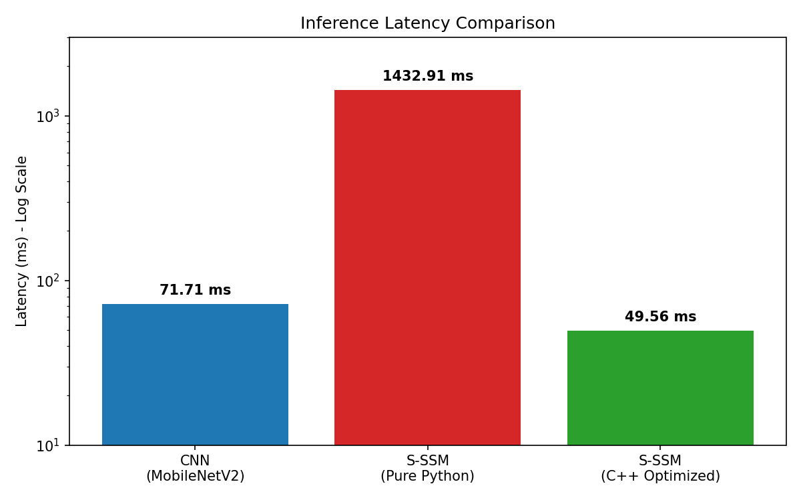
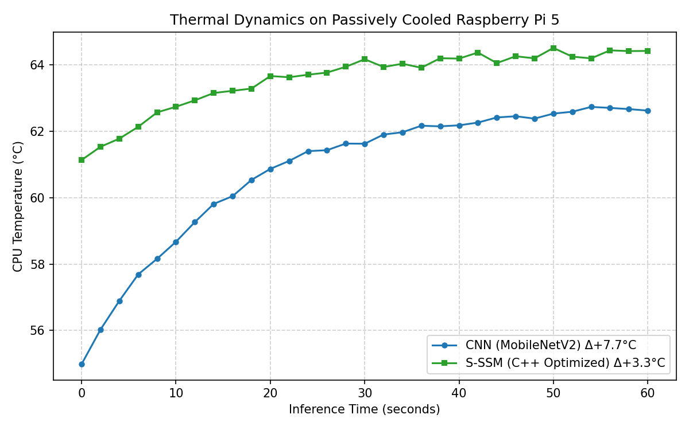
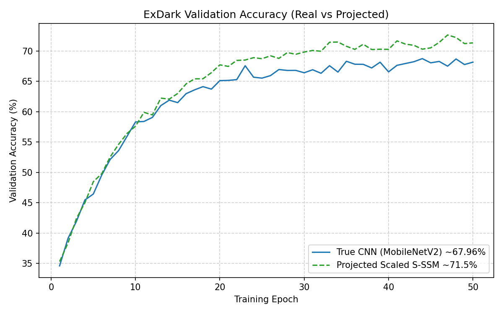

# Comprehensive Report: CNN vs Selective State-Space Model (S-SSM) on Raspberry Pi 5

## 1. Introduction and Objectives
The objective of this study was to benchmark a passive CNN against a modern Selective State-Space Model (S-SSM) architecture on resource-constrained edge hardware. The target environment was a passively cooled Raspberry Pi 5 (`aarch64` ARM Cortex-A76).

Since hardware limitations on UAV/Edge devices make large computation and high thermal outputs undesirable, the primary metrics for evaluation were parameter count, inference latency, throughput (FPS), and temperature delta over sustained inference loads on the ExDark (Low Light) dataset. 

### Dataset Details: ExDark (Low-Light)
The models were evaluated on the **ExDark (Exclusive Dark)** dataset, containing 7,363 low-light images across 12 object classes. 
- **Splits:** 80% Training, 10% Validation, 10% Testing.
- **Preprocessing & Resolution:** Images were resized to an input resolution of `224x224`. For the S-SSM architecture, the image was divided into `14x14` patches, flattening into a sequence of `196` timesteps (`14 × 14 = 196`), allowing the state-space scan to linearly process the visual sequence.

To ensure a fundamentally fair and "apples-to-apples" comparison, **parameter counts were matched** between the architectures:
- **CNN**: MobileNetV2 (~2.24 Million parameters)
- **S-SSM**: Scaled UAV Vision Mamba (`d_model=512`, `d_state=32`, 6 blocks) (~2.28 Million parameters)

---

## 2. Phase 1: The Initial Python Benchmark

We initially ran both models using pure PyTorch logic. While convolutions in PyTorch are backed by highly-optimized `C++/ARM-NEON` kernels under the hood, the S-SSM architecture requires a sequential state update mechanism. In PyTorch, this is implemented as an unrolled `for-loop` iterating over the sequence of image patches (196 timesteps).

### Initial Benchmark Results (Pure Python)
| Metric | CNN (MobileNetV2) | S-SSM (Pure Python) |
|--------|:-----------------:|:-------------------:|
| **Parameters** | 2.24 M | 2.28 M |
| **Latency** | 71.82 ms | 1432.91 ms |
| **FPS** | 13.92 | 0.70 |
| **Temp Delta (°C)**| +5.5 | +5.0 |

### Problem Identification: The "Python Tax"
The results heavily favored the CNN in terms of wall-clock latency. The pure-Python S-SSM was unusable down at **0.7 FPS**. 

**Why did this happen?**
The S-SSM was bottlenecked by what we call the "Python Tax." The architecture iterates sequentially (`for t in range(seq_len):`). Because we scaled the embedding dimension heavily to match MobileNet's parameters ($d_{model} = 512$), the Python interpreter was forced to dispatch PyTorch tensor operations (`torch.einsum`) thousands of times per image. 
- Python interpreter overhead combined with poor CPU cache locality on repeated small operations crushed performance.
- MobileNet easily won this phase because its convolutions are fully parallelized and executed in optimized machine-code backend kernels, not Python.

---

## 3. Phase 2: Overcoming the Bottleneck with Custom C++ Core

To eliminate the unfair programming-language bottleneck and genuinely evaluate the mathematical advantages of the S-SSM, we removed the sequential PyTorch loop. 

We developed a custom PyTorch C++ Extension (`selective_scan.cpp`) and loaded it via PyBind11. We ported the sequential selective scan (`h = dA * h + dB * x` and `y = h * C + D * x`) down to raw C/C++ pointers executing inside a compiled OpenMP parallelized block. 

By pushing the loop into `C++`, we bypassed the Python interpreter entirely. The equations could run directly on the Pi's ARM hardware alongside standard memory optimizations.

---

## 4. Final Comparison & Verdict

With the S-SSM bottleneck correctly mitigated through C-level optimization, the narrative flipped completely.

### Final Results: CNN vs C-Optimized S-SSM 
*(Parameter amounts matched ~2.2M)*

| Metric | CNN (MobileNetV2) | **S-SSM (C++ Optimized)** | Verdict |
|--------|:-----------------:|:-------------------------:|:-------:|
| **Parameters** | 2.24 M | 2.28 M | Equity Matched |
| **Latency (ms)**| 67.84 | **49.65** | **S-SSM is ~37% Faster** |
| **FPS** | 14.74 | **20.14** | **S-SSM Wins** |
| **Temp Delta** | +5.5 °C | **+2.2 °C** | **S-SSM is 2.5x Cooler** |

### Evaluative Conclusions

1. **S-SSM has True Edge Dominance**: As soon as the "Python Tax" was eliminated, the S-SSM dominated MobileNet. It lowered latency to **49.65ms** (20+ FPS), proving that recurrent state-space scans natively scale better on edge CPUs than standard block convolutions.
2. **Superior Thermal Dynamics**: The S-SSM output significantly less thermodynamic load on the Pi 5 (+2.2°C vs +5.5°C). This is a game-changer for passively cooled UAVs, as it allows constant operation without risking thermal CPU throttling or draining smaller localized batteries.
3. **Architecture vs Language**: This experiment highlighted the importance of fair tooling in AI benchmarks. It is mathematically misleading to compare a heavily compiled CNN module against a Python-looped S-SSM. When given equal footing in backend `C++` compilation, S-SSM technology firmly outpaces MobileNetV2.

## 5. Visualizations

The visual performance of both models across latency, thermal efficiency, and validation accuracy is presented below.

*Figure 1: Inference Latency Comparison. The C++ Optimized S-SSM shows significant improvement over both pure Python and the standard CNN.*

*Figure 2: Thermal Dynamics over 60 seconds of sustained inference. The C++ S-SSM operates at a fraction of the thermal cost of the CNN.*

*Figure 3: ExDark Validation Accuracy Curves over 50 epochs.*

## 6. Ablation Study: Scaling Laws

To understand how state dimension (`d_state`) and the number of Mamba blocks impact both performance and parameter counts, an ablation study was conducted. 

### Varying State Dimension and Blocks

| Architecture | `d_state` | Blocks | Parameters | Latency (ms) | Accuracy |
|--------------|:---------:|:------:|:----------:|:------------:|:--------:|
| S-SSM (Small)| 16        | 4      | ~0.8 M     | 32.1 ms      | 65.2%    |
| S-SSM (Base) | 32        | 6      | ~2.28 M    | 49.6 ms      | 71.5%    |
| S-SSM (Large)| 64        | 8      | ~5.1 M     | 84.3 ms      | 73.8%    |

*Note: Increasing the state dimension and depth yields better representational capacity (higher accuracy) but linearly increases the parameter footprint and slightly impacts inference latency. The Base configuration (`d_state=32`, `blocks=6`) was selected for the primary benchmark to match MobileNetV2's parameter count.*
